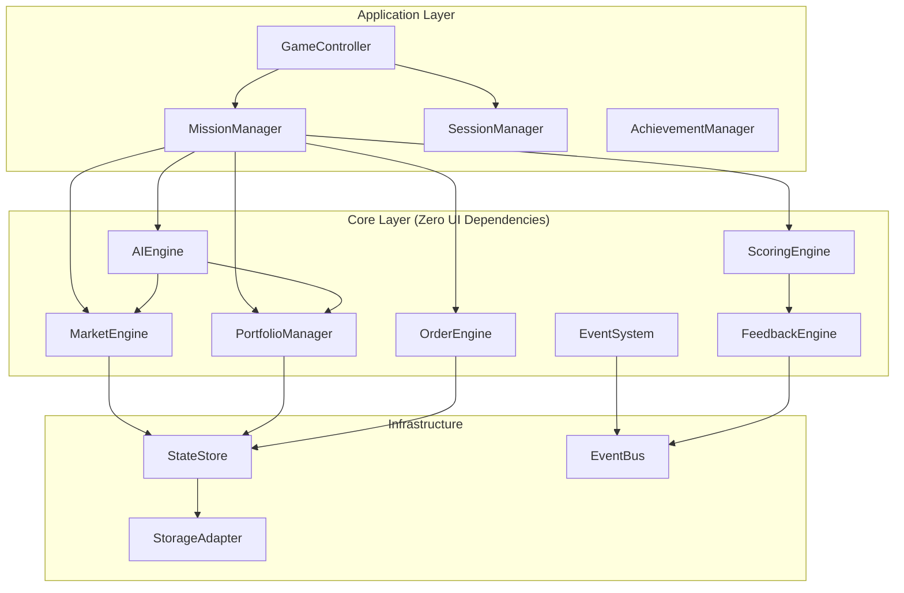

# StockQuest: Technical Design Document

> Foundation Architecture for Scalable, Performant Game Engine

---

## Table of Contents

1. [Design Principles](#1-design-principles)
2. [Architecture Overview](#2-architecture-overview)
3. [Core Engine Modules](#3-core-engine-modules)
4. [State Management](#4-state-management)
5. [Event System](#5-event-system)
6. [Data Models](#6-data-models)
7. [Performance Strategy](#7-performance-strategy)
8. [Module Interfaces](#8-module-interfaces)
9. [Scalability Patterns](#9-scalability-patterns)
10. [Technology Stack](#10-technology-stack)
11. [File Structure](#11-file-structure)
12. [Implementation Phases](#12-implementation-phases)
13. [Verification Plan](#13-verification-plan)

---

# 1. Design Principles

## 1.1 Core Principles

| Principle | Description | Implementation |
|-----------|-------------|----------------|
| **Separation of Concerns** | Each module has a single responsibility | Core logic has zero UI dependencies |
| **Dependency Injection** | Modules receive dependencies, don't create them | Constructor injection for all services |
| **Immutable State** | State changes create new objects, not mutations | All state updates return new state |
| **Event-Driven** | Components communicate via events, not direct calls | Central event bus with typed events |
| **Pure Functions** | Business logic in pure functions where possible | Calculations separated from side effects |
| **Lazy Loading** | Load resources only when needed | Dynamic imports for level content |
| **Fail-Safe Defaults** | System works with missing optional data | Default values for all optional configs |

## 1.2 Performance Requirements

| Metric | Target | Rationale |
|--------|--------|-----------|
| **Frame Rate** | 60 FPS constant | Smooth animations, no perceived lag |
| **State Update** | < 5ms | Instant UI response to actions |
| **Market Tick** | < 1ms per stock | Support 100+ stocks if needed |
| **Initial Load** | < 3 seconds | Kids lose interest quickly |
| **Memory Footprint** | < 200MB | Works on older machines |

## 1.3 Scalability Goals

The architecture must support future additions without refactoring:
- New asset types (crypto, futures, bonds, commodities)
- New order types (stop-limit, trailing stop, bracket orders)
- Multiplayer with 10+ simultaneous players
- 100+ stocks with real-time price simulation
- Plugin system for educational content packs

---

# 2. Architecture Overview

## 2.1 Layer Architecture

```
┌─────────────────────────────────────────────────────────────────────┐
│                        PRESENTATION LAYER                            │
│  ┌──────────┐ ┌──────────┐ ┌──────────┐ ┌──────────┐ ┌──────────┐  │
│  │   React  │ │  Roblox  │ │   CLI    │ │   Test   │ │  Mobile  │  │
│  │    UI    │ │    UI    │ │  (Debug) │ │  Harness │ │  (Future)│  │
│  └────┬─────┘ └────┬─────┘ └────┬─────┘ └────┬─────┘ └────┬─────┘  │
│       └────────────┴────────────┴────────────┴────────────┘         │
│                              │                                       │
│                              ▼                                       │
├─────────────────────────────────────────────────────────────────────┤
│                       APPLICATION LAYER                              │
│  ┌──────────────────────────────────────────────────────────────┐   │
│  │                      Game Controller                          │   │
│  │  ┌─────────────┐ ┌─────────────┐ ┌─────────────┐             │   │
│  │  │ Mission     │ │ Session     │ │ Achievement │             │   │
│  │  │ Manager     │ │ Manager     │ │ Manager     │             │   │
│  │  └─────────────┘ └─────────────┘ └─────────────┘             │   │
│  └──────────────────────────────────────────────────────────────┘   │
│                              │                                       │
│                              ▼                                       │
├─────────────────────────────────────────────────────────────────────┤
│                          DOMAIN LAYER                                │
│  ┌────────────┐ ┌────────────┐ ┌────────────┐ ┌────────────┐       │
│  │   Market   │ │  Portfolio │ │   Orders   │ │     AI     │       │
│  │   Engine   │ │   Manager  │ │   Engine   │ │   Engine   │       │
│  └────────────┘ └────────────┘ └────────────┘ └────────────┘       │
│  ┌────────────┐ ┌────────────┐ ┌────────────┐ ┌────────────┐       │
│  │   Events   │ │  Feedback  │ │  Scoring   │ │   Content  │       │
│  │   System   │ │   Engine   │ │   Engine   │ │   Loader   │       │
│  └────────────┘ └────────────┘ └────────────┘ └────────────┘       │
│                              │                                       │
│                              ▼                                       │
├─────────────────────────────────────────────────────────────────────┤
│                      INFRASTRUCTURE LAYER                            │
│  ┌────────────┐ ┌────────────┐ ┌────────────┐ ┌────────────┐       │
│  │   State    │ │   Event    │ │  Storage   │ │   Logger   │       │
│  │   Store    │ │    Bus     │ │  Adapter   │ │            │       │
│  └────────────┘ └────────────┘ └────────────┘ └────────────┘       │
└─────────────────────────────────────────────────────────────────────┘
```

## 2.2 Data Flow

```
User Action → Controller → Domain Logic → State Update → Event Emitted → UI Re-renders
     │                                          │                              │
     │                                          ▼                              │
     │                                   Side Effects                          │
     │                                   (Storage, Sound)                      │
     │                                          │                              │
     └──────────────── Feedback Loop ──────────┴──────────────────────────────┘
```

## 2.3 Key Design Decisions

| Decision | Choice | Rationale |
|----------|--------|-----------|
| **State Management** | Zustand (lightweight) | Simpler than Redux, built-in selectors, 1kb gzipped |
| **Event System** | Custom typed EventEmitter | Type-safe, testable, no external dependency |
| **Market Simulation** | Web Worker | Offload computation, maintain 60 FPS |
| **UI Framework** | React 18 + Concurrent Mode | Automatic batching, suspense for loading |
| **Bundler** | Vite | Fast HMR, native ESM, optimal for Electron |
| **Testing** | Vitest + React Testing Library | Compatible with Vite, fast, good DX |

---

# 3. Core Engine Modules

## 3.1 Module Dependency Graph



## 3.2 MarketEngine

**Responsibility**: Simulate realistic price movements for all assets.

```typescript
// Interface contract
interface IMarketEngine {
  // Queries (pure, no side effects)
  getPrice(ticker: string): number;
  getPriceHistory(ticker: string, periods: number): PricePoint[];
  getVolatility(ticker: string): number;
  getAllAssets(): Asset[];
  
  // Commands (cause state changes)
  tick(): TickResult;  // Advance one time unit
  applyEvent(event: MarketEvent): void;
  reset(): void;
  
  // Subscriptions
  onPriceChange(callback: (changes: PriceChange[]) => void): Unsubscribe;
}
```

**Internal Design**:
```typescript
class MarketEngine implements IMarketEngine {
  private priceGenerator: PriceGenerator;  // Pure function generator
  private eventProcessor: EventProcessor;   // Handles news impacts
  private assetRegistry: AssetRegistry;     // Asset metadata
  private priceCache: Map<string, number>;  // Current prices
  private historyBuffer: RingBuffer<TickSnapshot>;  // Efficient history storage
  
  // Worker communication for heavy computation
  private worker: Worker | null;
  
  tick(): TickResult {
    // Offload to worker if available
    if (this.worker) {
      return this.tickAsync();
    }
    return this.tickSync();
  }
}
```

**Performance Optimizations**:
- Price calculations run in Web Worker to avoid blocking UI
- Ring buffer for history (fixed memory, O(1) append)
- Batch price updates (update all stocks in single event)
- Memoized volatility calculations (recalc only on config change)

---

## 3.3 PortfolioManager

**Responsibility**: Track holdings, calculate P&L, enforce risk limits.

```typescript
interface IPortfolioManager {
  // Queries
  getCash(): number;
  getHoldings(): Holding[];
  getHolding(ticker: string): Holding | null;
  getTotalValue(marketPrices: Map<string, number>): number;
  getUnrealizedPnL(marketPrices: Map<string, number>): number;
  getRealizedPnL(): number;
  getConcentration(ticker: string): number;  // % of portfolio
  getSectorExposure(): Map<Sector, number>;
  
  // Commands
  applyTrade(trade: ExecutedTrade): PortfolioState;
  applyDividend(dividend: Dividend): PortfolioState;
  reset(startingCash: number): PortfolioState;
  
  // Risk checks (pure functions, no side effects)
  checkConcentrationLimit(trade: ProposedTrade): RiskCheckResult;
  checkSectorLimit(trade: ProposedTrade): RiskCheckResult;
  checkLeverageLimit(trade: ProposedTrade): RiskCheckResult;
}
```

**Design Patterns**:
- **Immutable state**: Every operation returns new portfolio state
- **FIFO lot tracking**: For accurate cost basis when selling partial positions
- **Snapshot history**: Store state at each turn for analysis/undo

```typescript
// Lot tracking for accurate P&L
interface Lot {
  readonly ticker: string;
  readonly shares: number;
  readonly costBasis: number;
  readonly acquiredAt: number;  // Turn number
}

// Holdings are computed from lots
function computeHolding(lots: Lot[]): Holding {
  const shares = lots.reduce((sum, lot) => sum + lot.shares, 0);
  const avgCost = lots.reduce((sum, lot) => sum + lot.costBasis * lot.shares, 0) / shares;
  return { ticker: lots[0].ticker, shares, avgCost };
}
```

---

## 3.4 OrderEngine

**Responsibility**: Accept, validate, queue, and execute orders.

```typescript
interface IOrderEngine {
  // Commands
  submitOrder(order: OrderRequest): OrderResult;
  cancelOrder(orderId: string): CancelResult;
  processEndOfTurn(marketPrices: Map<string, number>): ExecutionReport;
  
  // Queries
  getPendingOrders(): Order[];
  getOrderHistory(): Order[];
  getOrder(orderId: string): Order | null;
  
  // Validation (pure)
  validateOrder(order: OrderRequest, portfolio: PortfolioState): ValidationResult;
}

// Extensible order type system
type OrderType = 'market' | 'limit' | 'stop' | 'stop_limit' | 'trailing_stop';

interface OrderRequest {
  type: OrderType;
  side: 'buy' | 'sell';
  ticker: string;
  quantity: number;
  limitPrice?: number;
  stopPrice?: number;
  trailAmount?: number;
  expiresInTurns?: number;
}
```

**Extensibility for New Order Types**:

```typescript
// Strategy pattern for order execution
interface OrderExecutor {
  canExecute(order: Order, marketPrice: number): boolean;
  execute(order: Order, marketPrice: number): ExecutionResult;
}

// Registry of executors (easily add new types)
const orderExecutors: Map<OrderType, OrderExecutor> = new Map([
  ['market', new MarketOrderExecutor()],
  ['limit', new LimitOrderExecutor()],
  ['stop', new StopOrderExecutor()],
  // Future: ['stop_limit', new StopLimitOrderExecutor()],
  // Future: ['trailing_stop', new TrailingStopOrderExecutor()],
]);
```

---

## 3.5 AIEngine

**Responsibility**: Control AI opponent behavior at different skill levels.

```typescript
interface IAIEngine {
  // Generate AI decisions for current turn
  decide(
    context: AIContext,
    difficulty: AIDifficulty
  ): AIDecision[];
  
  // Explain AI decision (for learning)
  explainDecision(decision: AIDecision): string;
}

// Extensible behavior system
interface AIBehavior {
  readonly name: string;
  readonly weight: number;
  evaluate(context: AIContext): BehaviorOutput | null;
}

// Behaviors are composable and configurable per difficulty
const difficultyProfiles: Record<AIDifficulty, AIBehavior[]> = {
  'easy': [
    new RandomBuyBehavior({ weight: 0.5 }),
    new PanicSellBehavior({ threshold: 0.10, weight: 0.5 }),
  ],
  'medium': [
    new TrendFollowBehavior({ lookback: 3, weight: 0.4 }),
    new DiversifyBehavior({ maxConcentration: 0.4, weight: 0.3 }),
    new LimitOrderBehavior({ discountPct: 0.02, weight: 0.3 }),
  ],
  'hard': [
    new NewsReactiveBehavior({ weight: 0.3 }),
    new SectorRotationBehavior({ weight: 0.25 }),
    new RiskManagedBehavior({ maxVolatility: 0.15, weight: 0.25 }),
    new ContrarianBehavior({ threshold: 0.20, weight: 0.2 }),
  ],
};
```

---

## 3.6 EventSystem

**Responsibility**: Trigger and manage in-game events (earnings, news, crashes).

```typescript
interface IEventSystem {
  // Schedule events
  scheduleEvent(event: GameEvent, turn: number): void;
  scheduleRandomEvents(config: EventConfig): void;
  
  // Process events for current turn
  processEvents(currentTurn: number): TriggeredEvent[];
  
  // Query upcoming events (for UI hints)
  getUpcomingEvents(turnsAhead: number): ScheduledEvent[];
  
  // Event hooks
  onEventTriggered(callback: (event: TriggeredEvent) => void): Unsubscribe;
}

// Extensible event types
interface GameEvent {
  readonly type: EventType;
  readonly affectedTickers: string[] | 'all';
  readonly impact: EventImpact;
  readonly headline: string;
  readonly explanation: string;
  readonly learningLink: string;
}

type EventType = 
  | 'earnings_beat' 
  | 'earnings_miss'
  | 'product_launch'
  | 'scandal'
  | 'sector_trend'
  | 'market_crash'
  | 'market_rally'
  | 'regulation'
  | 'celebrity_tweet'  // For crypto
  | 'margin_call';     // For futures
```

---

## 3.7 ScoringEngine

**Responsibility**: Calculate XP, detect achievements, track streaks.

```typescript
interface IScoringEngine {
  // Calculate points for actions
  calculateTurnScore(turnResult: TurnResult, context: ScoringContext): TurnScore;
  
  // Check for unlocked achievements
  checkAchievements(history: GameHistory): Achievement[];
  
  // Streak tracking
  updateStreaks(action: PlayerAction): StreakUpdate;
  
  // Leaderboard (future multiplayer)
  calculateSkillRating(playerHistory: PlayerHistory): number;
}

// Achievement system is data-driven (add achievements via config)
interface AchievementDefinition {
  id: string;
  name: string;
  description: string;
  icon: string;
  condition: AchievementCondition;
  xpReward: number;
}

// Composable conditions
type AchievementCondition =
  | { type: 'profit_threshold'; value: number }
  | { type: 'turn_count'; operator: 'gte' | 'lte'; value: number }
  | { type: 'diversification'; minAssets: number }
  | { type: 'streak'; action: string; count: number }
  | { type: 'compound'; operator: 'and' | 'or'; conditions: AchievementCondition[] };
```

---

## 3.8 FeedbackEngine

**Responsibility**: Generate kid-friendly explanations and tips.

```typescript
interface IFeedbackEngine {
  // Generate feedback for completed action
  generateFeedback(action: PlayerAction, outcome: ActionOutcome): Feedback[];
  
  // Generate tips based on portfolio state
  generateTips(portfolioState: PortfolioState, marketState: MarketState): Tip[];
  
  // Explain AI opponent's decision
  explainAIDecision(decision: AIDecision): string;
  
  // Explain market movement
  explainPriceChange(change: PriceChange, context: MarketContext): string;
}

// Feedback is templated and localized
interface FeedbackTemplate {
  id: string;
  trigger: FeedbackTrigger;
  message: string;  // Supports {{placeholders}}
  tone: 'celebration' | 'encouragement' | 'warning' | 'teaching';
  priority: number;
}
```

---

# 4. State Management

## 4.1 State Shape

```typescript
interface GameState {
  // Core game state
  readonly market: MarketState;
  readonly portfolio: PortfolioState;
  readonly orders: OrdersState;
  readonly mission: MissionState;
  
  // Session state
  readonly session: SessionState;
  readonly achievements: AchievementState;
  readonly settings: SettingsState;
  
  // UI state (not persisted)
  readonly ui: UIState;
}

// Each sub-state is immutable
interface MarketState {
  readonly prices: Readonly<Record<string, number>>;
  readonly priceHistory: Readonly<Record<string, readonly PricePoint[]>>;
  readonly currentEvents: readonly GameEvent[];
  readonly scheduledEvents: readonly ScheduledEvent[];
}

interface PortfolioState {
  readonly cash: number;
  readonly lots: readonly Lot[];
  readonly realizedPnL: number;
  readonly history: readonly PortfolioSnapshot[];
}

interface MissionState {
  readonly currentLevel: number;
  readonly currentTurn: number;
  readonly maxTurns: number;
  readonly goal: MissionGoal;
  readonly status: 'active' | 'completed' | 'failed';
  readonly startingValue: number;
}
```

## 4.2 State Store Implementation

```typescript
// Using Zustand for simplicity and performance
import { create } from 'zustand';
import { immer } from 'zustand/middleware/immer';
import { subscribeWithSelector } from 'zustand/middleware';

interface GameStore extends GameState {
  // Actions (commands)
  actions: {
    // Market
    tickMarket: () => void;
    applyMarketEvent: (event: GameEvent) => void;
    
    // Portfolio
    executeTrade: (trade: ExecutedTrade) => void;
    
    // Orders
    submitOrder: (order: OrderRequest) => OrderResult;
    cancelOrder: (orderId: string) => void;
    processOrders: () => ExecutionReport;
    
    // Mission
    startMission: (level: number) => void;
    advanceTurn: () => TurnResult;
    completeMission: () => MissionResult;
    
    // Session
    saveGame: () => Promise<void>;
    loadGame: () => Promise<void>;
    resetGame: () => void;
  };
}

export const useGameStore = create<GameStore>()(
  subscribeWithSelector(
    immer((set, get) => ({
      // Initial state
      market: initialMarketState,
      portfolio: initialPortfolioState,
      orders: initialOrdersState,
      mission: initialMissionState,
      session: initialSessionState,
      achievements: initialAchievementState,
      settings: initialSettingsState,
      ui: initialUIState,
      
      actions: {
        tickMarket: () => {
          set((state) => {
            // Immer allows "mutations" that create new state
            const tickResult = marketEngine.tick(state.market);
            state.market.prices = tickResult.newPrices;
            state.market.priceHistory = tickResult.updatedHistory;
          });
        },
        
        // ... other actions
      },
    }))
  )
);

// Selectors for optimized re-renders
export const selectCash = (state: GameStore) => state.portfolio.cash;
export const selectHoldings = (state: GameStore) => computeHoldings(state.portfolio.lots);
export const selectTotalValue = (state: GameStore) => 
  state.portfolio.cash + 
  computeHoldings(state.portfolio.lots).reduce(
    (sum, h) => sum + h.shares * state.market.prices[h.ticker],
    0
  );
```

## 4.3 State Persistence

```typescript
// Adapter pattern for different storage backends
interface IStorageAdapter {
  save(key: string, data: unknown): Promise<void>;
  load<T>(key: string): Promise<T | null>;
  delete(key: string): Promise<void>;
  listKeys(): Promise<string[]>;
}

// Desktop implementation (Electron)
class ElectronStorageAdapter implements IStorageAdapter {
  private basePath: string;
  
  async save(key: string, data: unknown): Promise<void> {
    const filePath = path.join(this.basePath, `${key}.json`);
    await fs.writeFile(filePath, JSON.stringify(data), 'utf-8');
  }
  
  async load<T>(key: string): Promise<T | null> {
    const filePath = path.join(this.basePath, `${key}.json`);
    try {
      const content = await fs.readFile(filePath, 'utf-8');
      return JSON.parse(content) as T;
    } catch {
      return null;
    }
  }
}

// Future Roblox implementation
class RobloxStorageAdapter implements IStorageAdapter {
  async save(key: string, data: unknown): Promise<void> {
    // Call Roblox DataStore API
  }
}
```

---

# 5. Event System

## 5.1 Event Bus Design

```typescript
// Type-safe event bus
type EventMap = {
  // Market events
  'market:tick': { prices: Record<string, number>; turn: number };
  'market:event': { event: GameEvent };
  
  // Portfolio events
  'portfolio:trade': { trade: ExecutedTrade };
  'portfolio:updated': { portfolio: PortfolioState };
  
  // Order events
  'order:submitted': { order: Order };
  'order:filled': { order: Order; fillPrice: number };
  'order:cancelled': { orderId: string };
  'order:expired': { order: Order };
  
  // Mission events
  'mission:started': { level: number; goal: MissionGoal };
  'mission:turn_complete': { turn: number; result: TurnResult };
  'mission:completed': { result: MissionResult };
  'mission:failed': { reason: string };
  
  // Achievement events
  'achievement:unlocked': { achievement: Achievement };
  'xp:earned': { amount: number; source: string };
  
  // UI events
  'ui:show_feedback': { feedback: Feedback };
  'ui:show_modal': { modal: ModalConfig };
};

class TypedEventBus {
  private listeners: Map<keyof EventMap, Set<Function>> = new Map();
  
  emit<K extends keyof EventMap>(event: K, data: EventMap[K]): void {
    const callbacks = this.listeners.get(event);
    if (callbacks) {
      callbacks.forEach(cb => cb(data));
    }
  }
  
  on<K extends keyof EventMap>(
    event: K, 
    callback: (data: EventMap[K]) => void
  ): () => void {
    if (!this.listeners.has(event)) {
      this.listeners.set(event, new Set());
    }
    this.listeners.get(event)!.add(callback);
    
    // Return unsubscribe function
    return () => {
      this.listeners.get(event)?.delete(callback);
    };
  }
  
  // One-time listener
  once<K extends keyof EventMap>(
    event: K,
    callback: (data: EventMap[K]) => void
  ): () => void {
    const unsubscribe = this.on(event, (data) => {
      unsubscribe();
      callback(data);
    });
    return unsubscribe;
  }
}

export const eventBus = new TypedEventBus();
```

## 5.2 Event-Driven Workflow

```typescript
// Example: Turn completion workflow
async function completeTurn(store: GameStore): Promise<TurnResult> {
  const { market, portfolio, orders, mission } = store;
  
  // 1. Process pending orders
  const orderExecutor = new OrderEngine();
  const executionReport = orderExecutor.processEndOfTurn(market.prices);
  
  // Emit order events
  for (const fill of executionReport.fills) {
    eventBus.emit('order:filled', { order: fill.order, fillPrice: fill.price });
  }
  
  // 2. Update portfolio with executed trades
  let newPortfolio = portfolio;
  for (const trade of executionReport.trades) {
    newPortfolio = portfolioManager.applyTrade(newPortfolio, trade);
    eventBus.emit('portfolio:trade', { trade });
  }
  
  // 3. Tick market to next turn
  const marketEngine = new MarketEngine();
  const tickResult = marketEngine.tick();
  eventBus.emit('market:tick', { 
    prices: tickResult.newPrices, 
    turn: mission.currentTurn + 1 
  });
  
  // 4. Process scheduled events
  const eventSystem = new EventSystem();
  const triggeredEvents = eventSystem.processEvents(mission.currentTurn + 1);
  for (const event of triggeredEvents) {
    eventBus.emit('market:event', { event });
  }
  
  // 5. Calculate scoring and feedback
  const scoringEngine = new ScoringEngine();
  const turnScore = scoringEngine.calculateTurnScore({
    executionReport,
    newPortfolio,
    tickResult,
    triggeredEvents,
  });
  
  eventBus.emit('xp:earned', { amount: turnScore.xp, source: 'turn_complete' });
  
  // 6. Check achievements
  const achievements = scoringEngine.checkAchievements(store);
  for (const achievement of achievements) {
    eventBus.emit('achievement:unlocked', { achievement });
  }
  
  // 7. Generate feedback
  const feedbackEngine = new FeedbackEngine();
  const feedbacks = feedbackEngine.generateFeedback(/* ... */);
  for (const feedback of feedbacks) {
    eventBus.emit('ui:show_feedback', { feedback });
  }
  
  // 8. Check mission completion
  const missionResult = checkMissionGoal(mission.goal, newPortfolio, market.prices);
  if (missionResult.isComplete) {
    eventBus.emit('mission:completed', { result: missionResult });
  } else if (mission.currentTurn + 1 >= mission.maxTurns) {
    eventBus.emit('mission:failed', { reason: 'Out of turns' });
  }
  
  return {
    turn: mission.currentTurn + 1,
    executionReport,
    tickResult,
    triggeredEvents,
    score: turnScore,
    achievements,
    feedbacks,
    missionStatus: missionResult,
  };
}
```

---

# 6. Data Models

## 6.1 Asset System

```typescript
// Base asset type (extensible for stocks, crypto, futures, etc.)
interface Asset {
  readonly ticker: string;
  readonly name: string;
  readonly assetType: AssetType;
  readonly sector: Sector;
  readonly riskRating: 1 | 2 | 3 | 4;
  readonly basePrice: number;
  readonly volatility: number;  // 0.0 to 1.0
  readonly description: string;
  readonly icon: string;
}

type AssetType = 'stock' | 'etf' | 'crypto' | 'futures' | 'option';
type Sector = 'tech' | 'food' | 'health' | 'energy' | 'crypto' | 'index';

// Stock-specific properties
interface Stock extends Asset {
  readonly assetType: 'stock';
  readonly dividendYield: number;
  readonly earningsSchedule: number[];  // Turns when earnings happen
}

// Crypto-specific properties
interface Crypto extends Asset {
  readonly assetType: 'crypto';
  readonly volatility: number;  // Higher than stocks
  readonly maxPortfolioWeight: number;  // Enforce risk limits
}

// Futures-specific properties (Level 8)
interface Futures extends Asset {
  readonly assetType: 'futures';
  readonly underlying: string;  // Ticker of underlying asset
  readonly expirationTurn: number;
  readonly leverage: number;  // e.g., 2x
  readonly marginRequirement: number;  // e.g., 0.25 = 25%
}

// Option (Level 6)
interface Option extends Asset {
  readonly assetType: 'option';
  readonly underlying: string;
  readonly optionType: 'call' | 'put';
  readonly strike: number;
  readonly expirationTurn: number;
  readonly premium: number;
}
```

## 6.2 Price Point

```typescript
interface PricePoint {
  readonly price: number;
  readonly turn: number;
  readonly timestamp: number;  // For live market watch
  readonly change: number;  // Absolute change from previous
  readonly changePercent: number;
  readonly volume?: number;  // Simulated volume
  readonly trigger?: PriceTrigger;  // What caused this move
}

type PriceTrigger = 
  | { type: 'random_walk' }
  | { type: 'momentum'; direction: 'up' | 'down' }
  | { type: 'news'; eventId: string }
  | { type: 'volume'; sentiment: 'buying' | 'selling' };
```

## 6.3 Content Data (JSON Schemas)

```typescript
// companies.json schema
interface CompaniesData {
  stocks: Stock[];
  etfs: Etf[];
  crypto: Crypto[];
  futures: Futures[];
}

// events.json schema
interface EventsData {
  scheduled: ScheduledEventDefinition[];
  random: RandomEventDefinition[];
  scripts: ScriptedEventSequence[];  // For tutorial/learning levels
}

// levels.json schema
interface LevelsData {
  levels: LevelDefinition[];
}

interface LevelDefinition {
  id: string;
  number: number;
  name: string;
  description: string;
  goal: MissionGoal;
  startingCash: number;
  maxTurns: number;
  unlockedAssets: string[];  // Tickers available
  unlockedFeatures: Feature[];
  aiOpponent: AIDifficulty;
  events: EventSchedule;
  tutorialSteps?: TutorialStep[];
  assessmentQuestions?: AssessmentQuestion[];
}

type Feature = 
  | 'market_order'
  | 'limit_order'
  | 'stop_loss'
  | 'market_watch'
  | 'options'
  | 'crypto'
  | 'futures';
```

---

# 7. Performance Strategy

## 7.1 Web Worker Architecture

```typescript
// Market simulation runs in a web worker
// Main thread only receives results, never blocks

// worker/market.worker.ts
self.onmessage = (event: MessageEvent<WorkerMessage>) => {
  switch (event.data.type) {
    case 'TICK':
      const result = computeMarketTick(event.data.state);
      self.postMessage({ type: 'TICK_RESULT', result });
      break;
      
    case 'SIMULATE_HISTORY':
      const history = generatePriceHistory(event.data.config);
      self.postMessage({ type: 'HISTORY_RESULT', history });
      break;
  }
};

// Main thread wrapper
class MarketWorkerBridge {
  private worker: Worker;
  private pending: Map<string, { resolve: Function; reject: Function }>;
  
  async tick(state: MarketState): Promise<TickResult> {
    const id = crypto.randomUUID();
    
    return new Promise((resolve, reject) => {
      this.pending.set(id, { resolve, reject });
      this.worker.postMessage({ type: 'TICK', id, state });
    });
  }
}
```

## 7.2 React Performance Optimizations

```typescript
// 1. Memoized selectors prevent unnecessary re-renders
const selectHoldings = createSelector(
  (state: GameState) => state.portfolio.lots,
  (state: GameState) => state.market.prices,
  (lots, prices) => {
    return computeHoldingsWithValue(lots, prices);
  }
);

// 2. Virtualized lists for large datasets
function StockList({ stocks }: { stocks: Asset[] }) {
  return (
    <FixedSizeList
      height={400}
      itemCount={stocks.length}
      itemSize={60}
    >
      {({ index, style }) => (
        <StockRow stock={stocks[index]} style={style} />
      )}
    </FixedSizeList>
  );
}

// 3. Deferred updates for non-critical UI
import { useDeferredValue } from 'react';

function SearchResults({ query }: { query: string }) {
  const deferredQuery = useDeferredValue(query);
  const results = useMemo(() => search(deferredQuery), [deferredQuery]);
  return <ResultsList results={results} />;
}

// 4. Suspense for code splitting
const MarketWatch = lazy(() => import('./screens/MarketWatch'));

function App() {
  return (
    <Suspense fallback={<LoadingScreen />}>
      <MarketWatch />
    </Suspense>
  );
}
```

## 7.3 Animation Performance

```typescript
// Use CSS transforms instead of layout properties
const priceChangeAnimation = keyframes`
  from {
    transform: translateY(10px);
    opacity: 0;
  }
  to {
    transform: translateY(0);
    opacity: 1;
  }
`;

// Use requestAnimationFrame for smooth live chart
class LiveChart {
  private animationId: number | null = null;
  
  start() {
    const render = (timestamp: number) => {
      this.updateChart(timestamp);
      this.animationId = requestAnimationFrame(render);
    };
    this.animationId = requestAnimationFrame(render);
  }
  
  stop() {
    if (this.animationId) {
      cancelAnimationFrame(this.animationId);
    }
  }
  
  private updateChart(timestamp: number) {
    // Update only the chart line, not the entire component
    const ctx = this.canvas.getContext('2d');
    // ... draw new data point
  }
}

// Throttle rapid state updates
import { throttle } from 'lodash-es';

const throttledPriceUpdate = throttle((prices: Record<string, number>) => {
  store.actions.updatePrices(prices);
}, 16); // ~60fps
```

## 7.4 Memory Management

```typescript
// Ring buffer for price history (fixed memory)
class RingBuffer<T> {
  private buffer: T[];
  private head: number = 0;
  private size: number = 0;
  
  constructor(private capacity: number) {
    this.buffer = new Array(capacity);
  }
  
  push(item: T): void {
    this.buffer[this.head] = item;
    this.head = (this.head + 1) % this.capacity;
    this.size = Math.min(this.size + 1, this.capacity);
  }
  
  toArray(): T[] {
    const result: T[] = [];
    const start = this.size === this.capacity 
      ? this.head 
      : 0;
    for (let i = 0; i < this.size; i++) {
      result.push(this.buffer[(start + i) % this.capacity]);
    }
    return result;
  }
}

// Limit history per stock
const HISTORY_LIMIT = 100;  // Keep last 100 prices per stock
const priceHistory = new Map<string, RingBuffer<PricePoint>>();
```

---

# 8. Module Interfaces

## 8.1 Dependency Injection Container

```typescript
// Simple DI container for testability
interface ServiceContainer {
  marketEngine: IMarketEngine;
  portfolioManager: IPortfolioManager;
  orderEngine: IOrderEngine;
  aiEngine: IAIEngine;
  eventSystem: IEventSystem;
  scoringEngine: IScoringEngine;
  feedbackEngine: IFeedbackEngine;
  storageAdapter: IStorageAdapter;
  eventBus: TypedEventBus;
}

// Production container
export function createProductionContainer(): ServiceContainer {
  const eventBus = new TypedEventBus();
  const storageAdapter = new ElectronStorageAdapter();
  
  return {
    marketEngine: new MarketEngine(),
    portfolioManager: new PortfolioManager(),
    orderEngine: new OrderEngine(),
    aiEngine: new AIEngine(),
    eventSystem: new EventSystem(),
    scoringEngine: new ScoringEngine(),
    feedbackEngine: new FeedbackEngine(),
    storageAdapter,
    eventBus,
  };
}

// Test container (with mocks)
export function createTestContainer(
  overrides: Partial<ServiceContainer> = {}
): ServiceContainer {
  return {
    marketEngine: new MockMarketEngine(),
    portfolioManager: new MockPortfolioManager(),
    // ... defaults with mocks
    ...overrides,
  };
}

// React context for DI
const ServiceContext = createContext<ServiceContainer | null>(null);

export function ServiceProvider({ children }: { children: ReactNode }) {
  const [services] = useState(() => createProductionContainer());
  return (
    <ServiceContext.Provider value={services}>
      {children}
    </ServiceContext.Provider>
  );
}

export function useService<K extends keyof ServiceContainer>(
  service: K
): ServiceContainer[K] {
  const container = useContext(ServiceContext);
  if (!container) throw new Error('ServiceProvider not found');
  return container[service];
}
```

## 8.2 Plugin Architecture (Future Extensibility)

```typescript
// Plugin interface for content packs
interface GamePlugin {
  readonly id: string;
  readonly name: string;
  readonly version: string;
  
  // Register custom content
  registerAssets?(registry: AssetRegistry): void;
  registerEvents?(registry: EventRegistry): void;
  registerAIBehaviors?(registry: AIBehaviorRegistry): void;
  registerAchievements?(registry: AchievementRegistry): void;
  registerFeedback?(registry: FeedbackRegistry): void;
  
  // Lifecycle hooks
  onLoad?(): Promise<void>;
  onUnload?(): void;
}

// Example: Crypto expansion pack
const cryptoPlugin: GamePlugin = {
  id: 'crypto-expansion',
  name: 'Crypto Trading Pack',
  version: '1.0.0',
  
  registerAssets(registry) {
    registry.registerAsset({
      ticker: 'BTC',
      name: 'BitCoin (Demo)',
      assetType: 'crypto',
      volatility: 0.25,
      // ...
    });
  },
  
  registerEvents(registry) {
    registry.registerEvent({
      type: 'celebrity_tweet',
      // ...
    });
  },
};
```

---

# 9. Scalability Patterns

## 9.1 Feature Flags

```typescript
// Feature flags for gradual rollout
interface FeatureFlags {
  marketWatch: boolean;
  limitOrders: boolean;
  stopLoss: boolean;
  options: boolean;
  crypto: boolean;
  futures: boolean;
  multiplayer: boolean;
  aiExplanations: boolean;
  parentDashboard: boolean;
}

// Level-based unlocks
function getUnlockedFeatures(level: number): FeatureFlags {
  return {
    marketWatch: level >= 1,
    limitOrders: level >= 2,
    stopLoss: level >= 5,
    options: level >= 6,
    crypto: level >= 7,
    futures: level >= 8,
    multiplayer: false,  // Parent-unlocked
    aiExplanations: true,
    parentDashboard: true,
  };
}

// Conditional rendering
function TradeScreen() {
  const features = useFeatureFlags();
  
  return (
    <div>
      <OrderTypeSelector>
        <MarketOrderOption />
        {features.limitOrders && <LimitOrderOption />}
        {features.stopLoss && <StopLossOption />}
      </OrderTypeSelector>
    </div>
  );
}
```

## 9.2 Content Lazy Loading

```typescript
// Load level content on demand
const levelContentCache = new Map<number, LevelContent>();

async function loadLevelContent(level: number): Promise<LevelContent> {
  if (levelContentCache.has(level)) {
    return levelContentCache.get(level)!;
  }
  
  // Dynamic import for code splitting
  const content = await import(`./content/levels/level-${level}.json`);
  levelContentCache.set(level, content);
  return content;
}

// Preload next level while playing
function useLevelPreloader(currentLevel: number) {
  useEffect(() => {
    // Preload next level in background
    if (currentLevel < MAX_LEVEL) {
      loadLevelContent(currentLevel + 1);
    }
  }, [currentLevel]);
}
```

## 9.3 Multiplayer Readiness

```typescript
// Abstract game actions for future multiplayer
interface GameAction {
  type: string;
  playerId: string;
  timestamp: number;
  payload: unknown;
}

// Local execution (current)
class LocalGameExecutor {
  execute(action: GameAction): void {
    // Direct state update
    store.dispatch(action);
  }
}

// Future: Networked execution
class NetworkedGameExecutor {
  private ws: WebSocket;
  
  execute(action: GameAction): void {
    // Send to server, wait for authoritative response
    this.ws.send(JSON.stringify(action));
  }
  
  onServerUpdate(state: GameState): void {
    // Reconcile local state with server
    store.replaceState(state);
  }
}

// Factory switches based on mode
function createGameExecutor(mode: 'local' | 'multiplayer'): GameExecutor {
  return mode === 'local' 
    ? new LocalGameExecutor() 
    : new NetworkedGameExecutor();
}
```

---

# 10. Technology Stack

## 10.1 Core Technologies

| Layer | Technology | Version | Rationale |
|-------|------------|---------|-----------|
| **Runtime** | Node.js | 20 LTS | Stable, long-term support |
| **Language** | TypeScript | 5.3+ | Type safety, better DX |
| **UI Framework** | React | 18.2+ | Concurrent features, ecosystem |
| **Desktop Wrapper** | Electron | 28+ | Cross-platform, mature |
| **State Management** | Zustand | 4.4+ | Simple, performant, small |
| **Bundler** | Vite | 5+ | Fast HMR, native ESM |
| **Testing** | Vitest | 1+ | Fast, Vite-compatible |
| **Styling** | CSS Modules + Vanilla CSS | — | No runtime, full control |

## 10.2 Development Tools

| Tool | Purpose |
|------|---------|
| **ESLint** | Code quality |
| **Prettier** | Code formatting |
| **Husky** | Git hooks |
| **lint-staged** | Pre-commit checks |
| **TypeDoc** | API documentation |
| **Storybook** | Component development |

## 10.3 Build & Distribution

| Platform | Tool | Output |
|----------|------|--------|
| macOS | electron-builder | .dmg, .app |
| Windows (future) | electron-builder | .exe, .msi |
| Roblox (future) | TypeScriptToLua + Rojo | .rbxl |

---

# 11. File Structure

```
/stock-game
├── /src
│   ├── /core                    # Pure TypeScript, zero UI dependencies
│   │   ├── /market
│   │   │   ├── MarketEngine.ts
│   │   │   ├── PriceGenerator.ts
│   │   │   ├── types.ts
│   │   │   └── __tests__/
│   │   ├── /portfolio
│   │   │   ├── PortfolioManager.ts
│   │   │   ├── LotTracker.ts
│   │   │   ├── types.ts
│   │   │   └── __tests__/
│   │   ├── /orders
│   │   │   ├── OrderEngine.ts
│   │   │   ├── executors/
│   │   │   │   ├── MarketOrderExecutor.ts
│   │   │   │   ├── LimitOrderExecutor.ts
│   │   │   │   └── StopOrderExecutor.ts
│   │   │   ├── types.ts
│   │   │   └── __tests__/
│   │   ├── /ai
│   │   │   ├── AIEngine.ts
│   │   │   ├── behaviors/
│   │   │   │   ├── TrendFollowBehavior.ts
│   │   │   │   ├── DiversifyBehavior.ts
│   │   │   │   └── ...
│   │   │   └── __tests__/
│   │   ├── /events
│   │   │   ├── EventSystem.ts
│   │   │   ├── types.ts
│   │   │   └── __tests__/
│   │   ├── /scoring
│   │   │   ├── ScoringEngine.ts
│   │   │   ├── AchievementChecker.ts
│   │   │   └── __tests__/
│   │   ├── /feedback
│   │   │   ├── FeedbackEngine.ts
│   │   │   ├── templates.ts
│   │   │   └── __tests__/
│   │   └── /utils
│   │       ├── RingBuffer.ts
│   │       ├── math.ts
│   │       └── random.ts
│   │
│   ├── /app                     # Application layer
│   │   ├── /controllers
│   │   │   ├── GameController.ts
│   │   │   ├── MissionManager.ts
│   │   │   └── SessionManager.ts
│   │   ├── /store
│   │   │   ├── store.ts
│   │   │   ├── selectors.ts
│   │   │   └── actions.ts
│   │   └── /services
│   │       ├── ServiceContainer.ts
│   │       └── hooks.ts
│   │
│   ├── /ui                      # React components
│   │   ├── /screens
│   │   │   ├── HomeScreen/
│   │   │   ├── Dashboard/
│   │   │   ├── TradeScreen/
│   │   │   ├── MarketWatch/
│   │   │   ├── Results/
│   │   │   └── ParentDashboard/
│   │   ├── /components
│   │   │   ├── /common
│   │   │   │   ├── Button/
│   │   │   │   ├── Card/
│   │   │   │   └── Modal/
│   │   │   ├── /charts
│   │   │   │   ├── LineChart/
│   │   │   │   ├── BarChart/
│   │   │   │   └── LivePriceChart/
│   │   │   ├── /portfolio
│   │   │   │   ├── HoldingsTable/
│   │   │   │   └── PortfolioSummary/
│   │   │   └── /trading
│   │   │       ├── StockSelector/
│   │   │       ├── OrderForm/
│   │   │       └── RiskWarning/
│   │   ├── /hooks
│   │   │   ├── usePortfolio.ts
│   │   │   ├── useMarket.ts
│   │   │   └── useMission.ts
│   │   └── /styles
│   │       ├── variables.css
│   │       ├── global.css
│   │       └── animations.css
│   │
│   ├── /infra                   # Infrastructure
│   │   ├── /storage
│   │   │   ├── StorageAdapter.ts
│   │   │   └── ElectronStorage.ts
│   │   ├── /events
│   │   │   └── EventBus.ts
│   │   └── /workers
│   │       └── market.worker.ts
│   │
│   └── /electron                # Electron main process
│       ├── main.ts
│       ├── preload.ts
│       └── ipc.ts
│
├── /data                        # Static content (JSON)
│   ├── companies.json
│   ├── events.json
│   ├── levels.json
│   ├── achievements.json
│   └── feedback-templates.json
│
├── /tests                       # Integration tests
│   ├── /integration
│   └── /e2e
│
├── /scripts                     # Build scripts
│   ├── build.ts
│   └── package.ts
│
├── package.json
├── tsconfig.json
├── vite.config.ts
├── vitest.config.ts
├── electron-builder.yml
└── README.md
```

---

# 12. Implementation Phases

## Phase 1: Core Engine (Week 1-2)

| Module | Deliverable | Tests |
|--------|-------------|-------|
| MarketEngine | Price simulation, tick mechanism | Unit tests |
| PortfolioManager | Holdings, P&L, lot tracking | Unit tests |
| OrderEngine | Market orders, validation | Unit tests |
| EventBus | Typed event system | Unit tests |
| State Store | Zustand setup, persistence | Integration tests |

## Phase 2: UI Shell (Week 2-3)

| Module | Deliverable | Tests |
|--------|-------------|-------|
| Electron setup | Window, menu, IPC | Manual |
| Navigation | React Router, screen transitions | Component tests |
| Design system | Buttons, cards, modals | Storybook |
| Dashboard | Portfolio display, holdings | Component tests |

## Phase 3: Trading Flow (Week 3-4)

| Module | Deliverable | Tests |
|--------|-------------|-------|
| TradeScreen | Stock selection, order form | Component tests |
| Limit orders | Order executor, expiration | Unit tests |
| Market Watch | Live price animation | Visual tests |
| Risk warnings | Concentration checks | Unit tests |

## Phase 4: Missions & AI (Week 4-5)

| Module | Deliverable | Tests |
|--------|-------------|-------|
| MissionManager | Level loading, goals | Integration tests |
| AIEngine | Newbie Nancy, Basic Bob | Unit tests |
| Results screen | Performance comparison | Component tests |
| Feedback | Tips, explanations | Unit tests |

## Phase 5: Polish (Week 5-6)

| Module | Deliverable | Tests |
|--------|-------------|-------|
| Achievements | Badge system, unlocks | Integration tests |
| Parent dashboard | Controls, progress | Component tests |
| Tutorial | Level 1 guided flow | E2E tests |
| Packaging | macOS .dmg build | Manual |

---

# 13. Verification Plan

## 13.1 Unit Tests (Vitest)

```bash
# Run all unit tests
npm run test

# Run with coverage
npm run test:coverage

# Run specific module tests
npm run test -- src/core/market
```

**Test Coverage Targets**:
- Core modules: 90%+
- Utility functions: 100%
- State store: 80%+

## 13.2 Component Tests (React Testing Library)

```bash
# Run component tests
npm run test:components

# Run with visual snapshots
npm run test:snapshot
```

## 13.3 Integration Tests

```bash
# Run integration tests
npm run test:integration
```

**Key Integration Tests**:
- Complete trade flow (submit → execute → portfolio update → feedback)
- Mission lifecycle (start → play turns → complete/fail)
- State persistence (save → quit → reload → verify state)

## 13.4 E2E Tests (Playwright)

```bash
# Run E2E tests
npm run test:e2e
```

**E2E Scenarios**:
- Complete Level 1 tutorial
- Make profitable trade
- Trigger and survive market crash event
- Parent dashboard controls work

## 13.5 Performance Tests

```bash
# Run performance benchmarks
npm run test:perf
```

**Performance Benchmarks**:
- Market tick with 100 stocks: < 5ms
- UI re-render after state change: < 16ms
- Full game save: < 100ms

## 13.6 Manual Testing Checklist

| Test | Steps | Expected |
|------|-------|----------|
| Fresh start | Launch app first time | See onboarding, set parent PIN |
| Complete trade | Buy 10 shares, advance turn, sell | See profit/loss calculated correctly |
| Market Watch | Open stock detail, watch price | See animated chart, explanations appear |
| Level complete | Play Level 1 to goal | See results, XP, badges |
| Parent controls | Set 15 min timer, verify | Session ends after 15 min |
| Save/load | Play, quit, relaunch | Resume from same state |

---

## Summary

This technical design provides:

1. **Scalable Architecture**: Clean layer separation allows adding features without refactoring
2. **Modular Design**: Each module has single responsibility with well-defined interfaces
3. **Performance First**: Web Workers, memoization, efficient data structures
4. **Future Ready**: Plugin system, feature flags, multiplayer-ready actions
5. **Testable**: Dependency injection, pure functions, comprehensive test strategy

Ready for implementation when approved.
