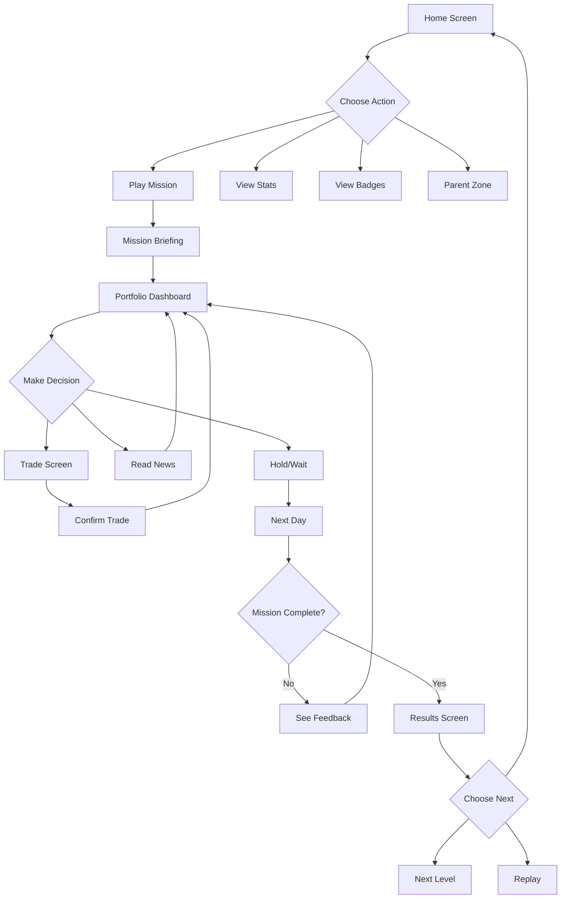
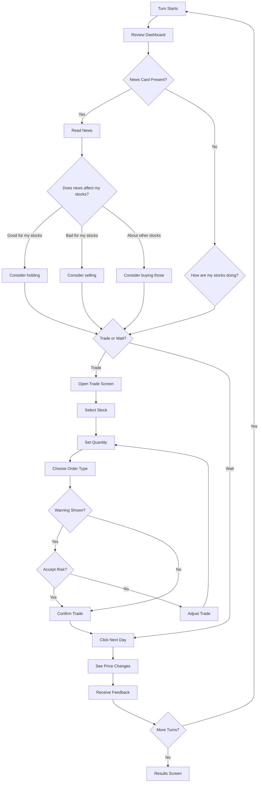

# StockQuest: User Flow & Decision Guide

> A visual walkthrough showing how kids learn investing through play

---

## Overview

This document shows the complete user journey through StockQuest, highlighting:
- **Screens** the child will see
- **Decisions** they'll make at each step
- **Learning moments** embedded in gameplay
- **Parent oversight** features

---

## Main Screen Flow



---

## Screen 1: Home Screen


### What Kids See
The home screen greets players with their current progress and three main choices.

### Decisions Available

| Button | What It Does | Learning Connection |
|--------|--------------|---------------------|
| **PLAY** | Continue current mission or start new level | Core gameplay loop |
| **MY STATS** | View XP, level progress, performance history | Tracking growth over time |
| **BADGES** | Collection of achievements earned | Positive reinforcement of good habits |

### Learning Moment
The **Daily Tip** banner introduces a new concept each day, building vocabulary before kids encounter it in gameplay.

> Example: "Diversification means spreading your investments across different companies so one bad day doesn't hurt too much!"

### Parent Feature
The **Parent Zone** button (locked with PIN) leads to the dashboard where parents can monitor progress and set controls.

---

## Screen 2: Mission Briefing


### What Kids See
A friendly robot mascot explains the mission goal in simple terms.

### Information Presented

| Element | Purpose | Example |
|---------|---------|---------|
| **Level Name** | Context for the skill | "First Trade" |
| **Goal** | Clear success criteria | "Make 2% profit ($200)" |
| **Concept Introduction** | New vocabulary | "A stock is a tiny piece of a company" |
| **Strategy Tip** | Guidance without answers | "Look for stocks with green arrows!" |

### Decision Point
**"LET'S GO!"** button - Child decides they understand the goal and are ready to begin.

### Learning Moment
- Goals are **specific and measurable** (not "do well" but "make 2%")
- Tips teach **observation skills** (look for patterns, read information)
- Simple language introduces **financial vocabulary** naturally

---

## Screen 3: Portfolio Dashboard


### What Kids See
The central hub showing their money, holdings, and market news.

### Key Information Display

| Section | What It Shows | Why It Matters |
|---------|---------------|----------------|
| **Mission Progress** | "Turn 4 of 10" | Creates urgency without stress |
| **Cash Balance** | Available money to invest | Teaches liquidity concept |
| **Holdings Table** | Stocks owned, current value, gain/loss | Portfolio tracking |
| **News Card** | Current market events | Information affects decisions |
| **Total Value** | Overall portfolio worth | The "score" of investing |

### Decisions Available

| Action | When To Use | What It Teaches |
|--------|-------------|-----------------|
| **TRADE** | Want to buy or sell stocks | Active investing decisions |
| **Read News** | Gather information first | Research before acting |
| **NEXT DAY** | Satisfied with current positions | Patience and holding |

### Learning Moments

1. **Green/Red Colors**: Instant visual feedback on gains and losses
2. **Percentage Display**: Math connection - what does +4.5% mean in dollars?
3. **News Integration**: Real investors read news before deciding

### Key Decision Framework
Kids learn to ask:
- "Do I have good stocks already?" (check holdings table)
- "Is there news that changes things?" (read news card)
- "Should I act or wait?" (trade vs next day)

---

## Screen 4: Trade Screen


### What Kids See
A selection of stocks to choose from, with details about each one.

### Stock Selection Factors

| Visual Element | Meaning | Kid's Question |
|----------------|---------|----------------|
| **Price** | Cost per share | "Can I afford this?" |
| **Arrow (↑/↓)** | Recent trend | "Is it going up or down?" |
| **Risk Stars (⭐)** | Volatility rating | "How risky is this?" |
| **Sector Label** | Industry category | "What kind of company?" |

### Decision Points

| Step | Decision | Learning |
|------|----------|----------|
| **1. Choose Stock** | Which company to invest in | Evaluating options |
| **2. Set Quantity** | How many shares | Position sizing |
| **3. Choose Order Type** | Market vs Limit | Patience vs speed |
| **4. Review Warning** | Act on risk alerts | Risk management |
| **5. Confirm** | Final commitment | Ownership of decisions |

### Critical Learning Moment: Diversification Warning

> ⚠️ "This would put 35% of your portfolio in Tech stocks. That's a bit risky! Consider diversifying."

The game **teaches through guardrails**:
- Warns but doesn't block (builds judgment, not dependence)
- Explains WHY it's risky (educational, not arbitrary)
- Suggests action (diversifying)

### Order Type Teaching

| Order | When Taught | Kid-Friendly Explanation |
|-------|-------------|--------------------------|
| **Market** | Level 1 | "Buy right now at today's price" |
| **Limit** | Level 2 | "Only buy if price drops to my target" |

---

## Screen 5: Results Screen


### What Kids See
Celebration of completion with detailed breakdown of what happened and why.

### Results Analysis

| Section | What It Shows | Learning Purpose |
|---------|---------------|------------------|
| **Performance Summary** | Start → End value | Concrete outcome |
| **Comparison Chart** | You vs Benchmark vs AI | Context for performance |
| **Achievements** | Badges earned | Positive reinforcement |
| **Learning Card** | Explanation of success/failure | Connect actions to outcomes |
| **AI Explanation** | Why opponent did better/worse | Learn from comparison |

### Key Learning Moment: The Feedback Loop

The results screen answers the critical question: **"Why did that happen?"**

**Example feedback:**
> "You held ZappyTech through a dip and it recovered. That's called 'staying the course'—panicking often leads to selling low!"

This connects:
- **Action** (holding) → **Outcome** (recovery) → **Principle** (patience pays)

### Decisions Available

| Choice | When To Pick | What It Develops |
|--------|--------------|------------------|
| **Next Level** | Ready for new challenge | Progression motivation |
| **Replay** | Want to practice more | Skill mastery |
| **Home** | Taking a break | Healthy gaming habits |

---

## Decision Tree: One Complete Turn

Here's exactly what decisions a child makes in a single turn:



---

## Learning Progression by Level

| Level | New Screen Elements | New Decisions | Concept Reinforced |
|-------|--------------------|--------------|--------------------|
| **1** | Basic dashboard, single stock | Buy/Sell, Market order | What is a stock |
| **2** | Multiple stocks, sectors | Allocation slider, Diversify | Don't put eggs in one basket |
| **3** | Index fund option | Active vs Passive | Benchmark comparison |
| **4** | Savings mode, interest calc | Contribution timing | Compound interest |
| **5** | Earnings calendar, more news | React vs Ignore news | Long-term thinking |
| **6** | Options contracts (calls/puts) | Insurance decisions | Protection strategies |
| **7** | Crypto assets, high volatility | Position limits | Risk management |
| **8** | Futures, margin meter | Leverage decisions | Amplified risk |

---

## Parent Dashboard (Not Shown - Image Pending)

### What Parents See
- Child's current level and skills mastered
- Total play time and session history
- Toggle controls for advanced features
- Weekly progress summary

### Parent Controls Available

| Control | Default | Options |
|---------|---------|---------|
| Session timer | 30 min | 15/30/60/Off |
| Daily XP cap | 500 | 250/500/1000/Off |
| Advanced levels | Locked | Lock/Unlock |
| Multiplayer chat | Off | Off/Emotes/Filtered |

---

## How Kids Learn Through Decisions

### The Decision-Consequence Loop

Every decision in StockQuest follows this pattern:

```
1. INFORMATION    →    2. DECISION    →    3. OUTCOME    →    4. FEEDBACK
   (News, charts)       (Buy/Sell/Hold)     (Price change)      (Tip explaining why)
```

### Example: Learning "Don't Panic Sell"

| Step | What Happens | What Child Learns |
|------|--------------|-------------------|
| **Turn 3** | Stock drops 10%, child sells in panic | — |
| **Turn 4** | Stock recovers +15% | Child missed gains |
| **Feedback** | "Selling during a dip locks in losses. Consider your timeframe!" | Patience principle |
| **Turn 8** | Similar dip happens | Child holds this time |
| **Result** | Stock recovers, child gains | Reinforced learning |

### Learning Through AI Comparison

After each mission, kids see what the AI opponent did differently:

> **Why Basic Bob lost:**
> "Bob sold RocketBurger when the scandal hit, locking in a -25% loss. You held through the fear and caught the 16% recovery. Sometimes the right move is to wait."

This teaches by **comparison**, not lecture.

---

## Safety by Design

### Every Screen Includes:

| Safety Feature | How It Works |
|----------------|--------------|
| **No real money references** | All values are virtual |
| **Fictional companies only** | No real stock symbols |
| **Age-appropriate language** | No jargon without explanation |
| **Parent access point** | Parent Zone always visible |
| **Session breaks** | Timer prompts after 30 min |

### What's NOT on Any Screen:

- ❌ Links to real brokers
- ❌ Real-time market data
- ❌ Purchase options or ads
- ❌ Open text chat
- ❌ Personal information requests

---

## Next Steps

Additional mockups to generate:
- [ ] Parent Dashboard
- [ ] News Event Popup
- [ ] Feedback Popup
- [ ] Glossary Screen
- [ ] Level Selection Map

---

*Document created: December 2024*
